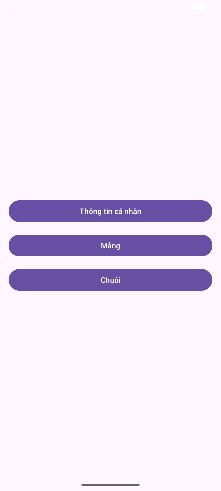
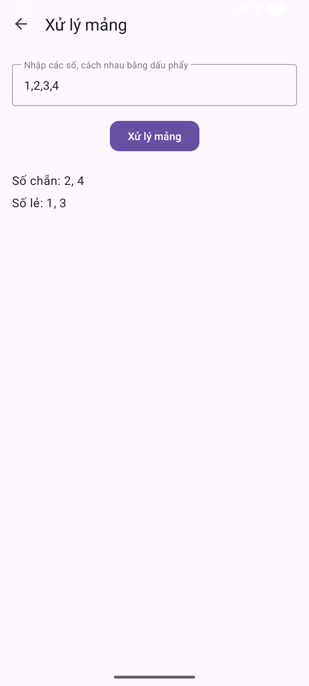
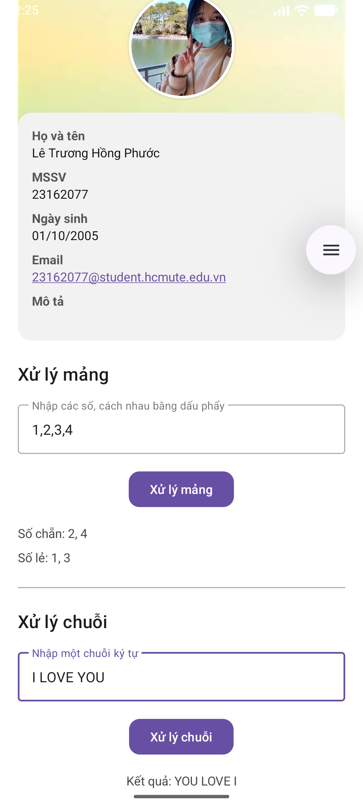

# 📱 Bài Tập Android – Baitap01  
Ứng dụng Android đơn giản gồm các yêu cầu: hiển thị thông tin sinh viên, ẩn thanh tiêu đề, xử lý mảng số, xử lý chuỗi.

---
## Ảnh minh họa

## 📱 Tính năng chính
- Hiển thị ảnh bìa và ảnh đại diện.
- Trình bày thông tin:
  - Họ và tên
  - MSSV
  - Ngày sinh
  - Email
  - Mô tả cá nhân
- Giao diện tối giản, dễ nhìn, sử dụng Material Components.

---

## 🧩 Công nghệ sử dụng
- **Ngôn ngữ:** Kotlin  
- **Giao diện:** XML Layout  
- **AndroidX + Material Design**  
- **Gradle (KTS)**
